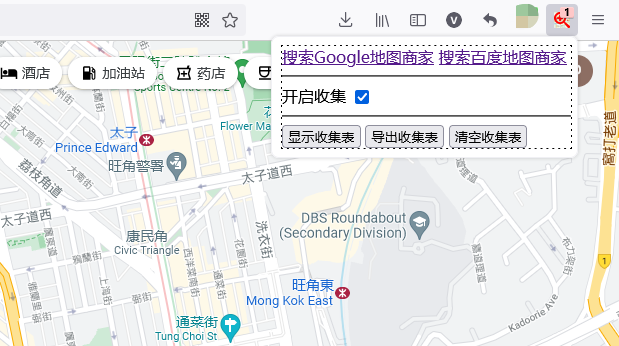
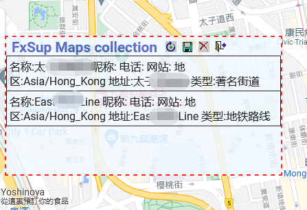

# FxSup-maps-collection
Mozilla Add-ons:FxSup Maps collection 地图信息收集 0.2
 
Add-ons download url:<a href="https://addons.mozilla.org/en-US/firefox/addon/fxsup-maps-collection/">https://addons.mozilla.org/en-US/firefox/addon/fxsup-maps-collection/</a>
 
Maps search business address collection is exported as CSV.
 
搜索地图商家信息收集导出为CSV，支持GOOGLE地图与百度地图
 
step 1: click "Start Sniffing"
 

 
step 2: Search for keywords in maps
 
step 3: Show table,download csv file
 

